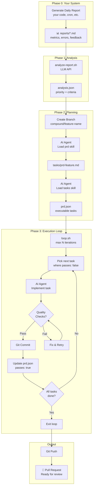

# Compound Product

A self-improving product system that reads daily reports, identifies the #1 actionable priority, and autonomously implements it.

**The concept:** Your product generates reports about its performance. An AI agent analyzes those reports, picks the most impactful fix, creates a plan, and implements it—all while you sleep. You wake up to a PR ready for review.

Built on [Kieran Klaassen's Compound Engineering](https://every.to/chain-of-thought/compound-engineering-how-every-codes-with-agents) methodology, [Geoffrey Huntley's Ralph pattern](https://ghuntley.com/ralph/), and [Ryan Carson's implementation](https://x.com/ryancarson/status/2008548371712135632).

## How It Works



## Quick Start

### Prerequisites

- [Amp CLI](https://ampcode.com) or [Claude Code](https://docs.anthropic.com/en/docs/claude-code)
- [agent-browser](https://github.com/vercel-labs/agent-browser) for browser-based testing (`npm install -g agent-browser`)
- `jq` installed (`brew install jq` on macOS)
- `gh` CLI installed and authenticated (`brew install gh`)
- One of these LLM providers configured:
  - **Anthropic:** `export ANTHROPIC_API_KEY=sk-ant-...`
  - **OpenRouter:** `export OPENROUTER_API_KEY=sk-or-...`
  - **AI Gateway:** `export AI_GATEWAY_URL=https://... AI_GATEWAY_API_KEY=...`

### Installation

Compound Product installs into your existing project repository. It adds scripts and configuration that work alongside your codebase.

```bash
# Clone compound-product somewhere temporary
git clone https://github.com/snarktank/compound-product.git
cd compound-product

# Install into your project
./install.sh /path/to/your/project
```

Or tell your AI agent (from within your project):
```
Install compound-product from https://github.com/snarktank/compound-product into this repo
```

This creates:
- `scripts/compound/` - The automation scripts
- `compound.config.json` - Configuration for your project
- `reports/` - Directory for your daily reports (you provide these)

### Configuration

Copy and customize the config:

```bash
cp config.example.json config.json
```

Edit `config.json`:

```json
{
  "tool": "amp",
  "reportsDir": "./reports",
  "outputDir": "./compound",
  "qualityChecks": ["npm run typecheck", "npm test"],
  "maxIterations": 25,
  "branchPrefix": "compound/"
}
```

### Running

```bash
# Dry run - see what it would do
./scripts/compound/auto-compound.sh --dry-run

# Full run
./scripts/compound/auto-compound.sh

# Just run the loop (if you already have prd.json)
./scripts/compound/loop.sh 10
```

## Report Format

Your report can be any markdown file. The AI will analyze it and pick the #1 actionable item.

Example report structure:

```markdown
# Daily Report - 2024-01-15

## Key Metrics
- Signups: 45 (down 20% from yesterday)
- Errors: 12 TypeErrors in checkout flow
- User feedback: "Can't find the save button"

## Issues
1. Checkout flow has JavaScript errors
2. Save button is below the fold on mobile
3. Email validation is too strict

## Recommendations
- Fix checkout JavaScript errors (blocking revenue)
- Move save button above fold
- Relax email validation
```

## The Loop

Each iteration of the loop:

1. **Reads** `prd.json` to find the next task where `passes: false`
2. **Implements** the task
3. **Runs quality checks** (configurable in `config.json`)
4. **Commits** if checks pass
5. **Updates** `prd.json` to mark task as `passes: true`
6. **Appends** learnings to `progress.txt`
7. **Repeats** until all tasks complete or max iterations reached

### Memory Between Iterations

Each iteration runs with fresh context. Memory persists via:

- **Git history** - Previous commits show what was done
- **progress.txt** - Learnings and patterns discovered
- **prd.json** - Which tasks are complete
- **AGENTS.md** - Long-term codebase knowledge (updated by agents)

## Skills

Two skills are included for PRD creation and task generation:

### PRD Skill

Creates a Product Requirements Document from a feature description.

```
Load the prd skill. Create a PRD for [your feature]
```

### Tasks Skill

Converts a PRD markdown file to `prd.json` with **granular, machine-verifiable tasks**.

Key features:
- Generates 8-15 small tasks (not 3-5 large ones)
- Each acceptance criterion is boolean pass/fail
- Browser tests use [agent-browser](https://github.com/vercel-labs/agent-browser) commands
- Investigation and implementation are separate tasks

```
Load the tasks skill. Convert tasks/prd-feature.md to prd.json
```

## Customization

### Custom Analysis Script

By default, `analyze-report.sh` uses the Anthropic API directly. To use your own:

```json
{
  "analyzeCommand": "npx tsx ./my-custom-analyze.ts"
}
```

Your script must output JSON to stdout:

```json
{
  "priority_item": "Fix checkout errors",
  "description": "...",
  "rationale": "...",
  "acceptance_criteria": ["...", "..."],
  "branch_name": "compound/fix-checkout-errors"
}
```

### Quality Checks

Configure your project's quality checks:

```json
{
  "qualityChecks": [
    "npm run typecheck",
    "npm run lint",
    "npm test"
  ]
}
```

### Branch Prefix

All branches are created with a prefix:

```json
{
  "branchPrefix": "compound/"
}
```

## ⚠️ Security Considerations

**This tool runs AI agents with elevated permissions.** Understand the risks before using:

### What the agents can do

- **Read and modify any file** in your repository
- **Execute shell commands** (build, test, git operations)
- **Make network requests** (API calls, git push)
- **Create branches and PRs** in your repository

### Safeguards in place

1. **PRs, not direct merges** - All changes go through pull requests for human review
2. **Quality checks** - Configurable checks run before commits
3. **Max iterations** - The loop stops after N iterations to prevent runaway execution
4. **Dry run mode** - Test the analysis phase without making changes

### Recommendations

- **Review PRs carefully** before merging
- **Run in a separate environment** (VM, container) if concerned about file access
- **Use API keys with limited scope** where possible
- **Don't use on production branches** - always target a feature branch
- **Monitor the first few runs** to understand behavior

### The `--dangerously-allow-all` flag

The scripts use `--dangerously-allow-all` (Amp) and `--dangerously-skip-permissions` (Claude Code) to allow autonomous operation. This means the agent bypasses normal confirmation prompts. This is intentional for automation but means you're trusting the agent to make good decisions.

## Philosophy

**Compound Product** is based on the idea that each improvement should make future improvements easier:

1. **Agents update AGENTS.md** - Discovered patterns are documented for future iterations
2. **Progress is logged** - Each task records what was learned
3. **Small tasks compound** - Many small, correct changes beat large, risky ones
4. **Human review remains** - The loop creates PRs, not direct merges

## Scheduling (macOS launchd)

To run Compound Product automatically (e.g., every night), use macOS launchd:

```bash
# Copy the example plist
cp examples/com.compound.plist.example ~/Library/LaunchAgents/com.compound.myproject.plist

# Edit it with your project path and username
nano ~/Library/LaunchAgents/com.compound.myproject.plist

# Load it
launchctl load ~/Library/LaunchAgents/com.compound.myproject.plist

# Check status (last column is exit code, 0 = success)
launchctl list | grep compound
```

**Important: PATH configuration**

launchd runs with a minimal PATH. You must include the directories where your tools are installed:

```bash
# Find where your CLI is installed
which amp    # e.g., /Users/you/.npm-global/bin/amp
which claude # e.g., /opt/homebrew/bin/claude
```

Update the `PATH` in your plist to include these directories. The example plist includes common locations.

**Troubleshooting launchd:**

```bash
# Check logs
tail -f /path/to/your/project/logs/compound.log

# Unload and reload
launchctl unload ~/Library/LaunchAgents/com.compound.myproject.plist
launchctl load ~/Library/LaunchAgents/com.compound.myproject.plist

# Test manually (should produce same result as launchd)
/bin/bash -c 'cd /path/to/project && ./scripts/compound/auto-compound.sh --dry-run'
```

## Troubleshooting

### Loop exits early

Check `progress.txt` for errors. Common issues:

- Quality checks failing (fix the code or adjust checks)
- Task too large (split into smaller tasks)
- Context overflow (task description needs to be more focused)

### Analysis fails

Ensure one of these LLM providers is configured:

```bash
# Option 1: Anthropic API
export ANTHROPIC_API_KEY=sk-ant-...

# Option 2: OpenRouter
export OPENROUTER_API_KEY=sk-or-...

# Option 3: AI Gateway (any OpenAI-compatible endpoint)
export AI_GATEWAY_URL=https://your-gateway.com/v1
export AI_GATEWAY_API_KEY=your-key
export AI_GATEWAY_MODEL=claude-sonnet-4-20250514  # optional
```

### Agent can't find tools

For Amp, ensure skills are installed:

```bash
ls ~/.config/amp/skills/
```

For Claude Code:

```bash
ls ~/.claude/skills/
```

## Contributing

PRs welcome! Please keep changes focused and include tests where applicable.

## License

MIT
